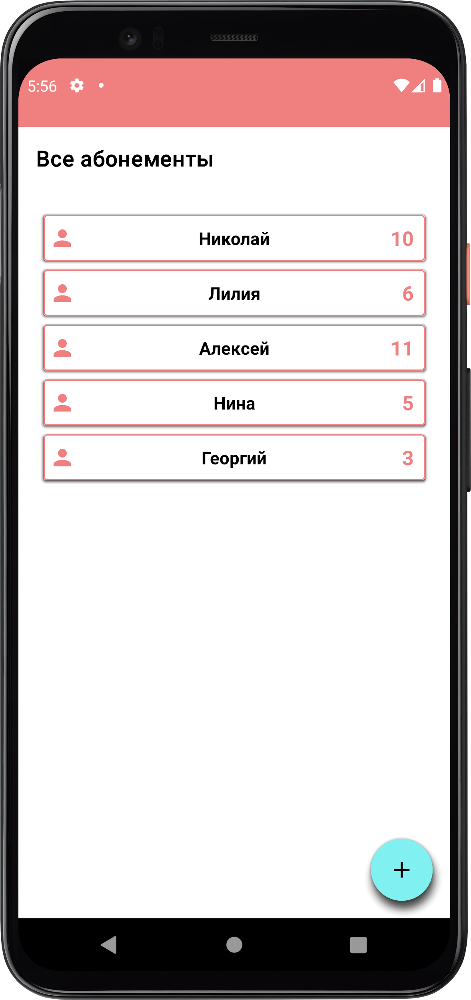
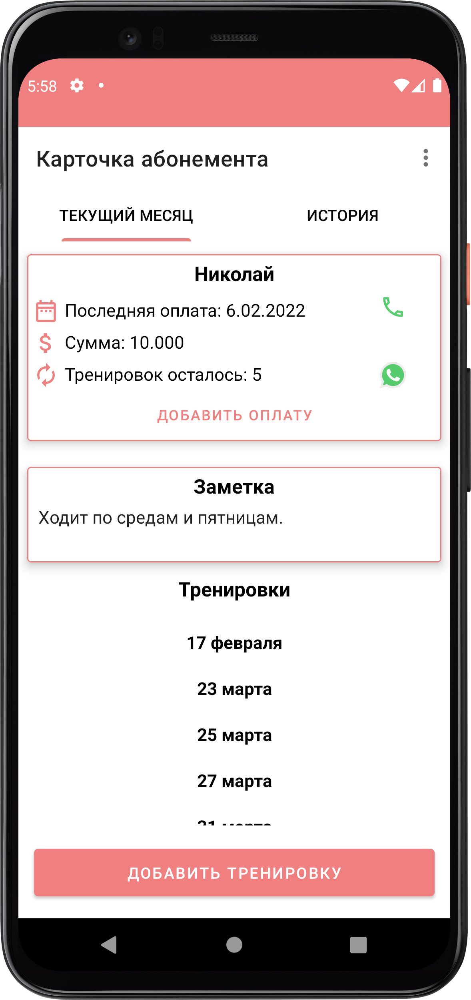
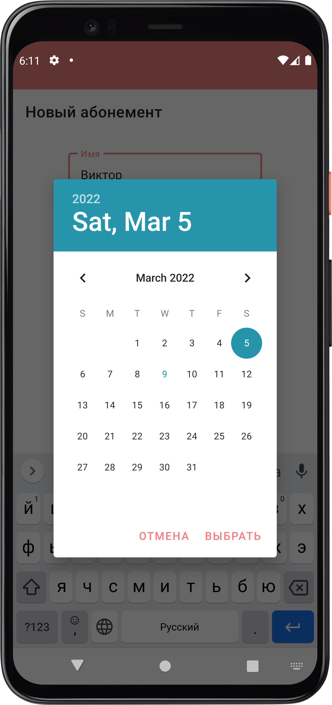
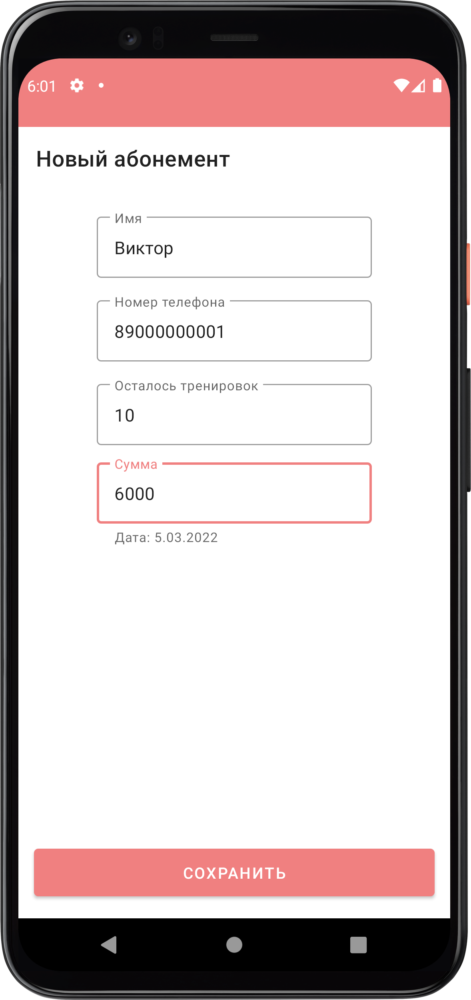
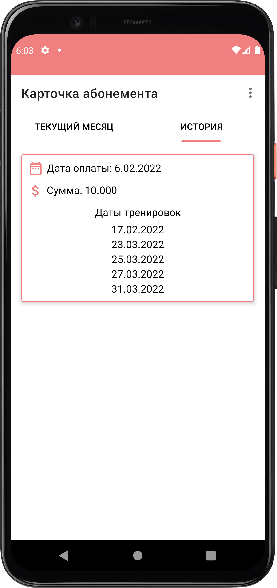

# Coral - an app to manage memberships.

**App language**: Russian    
**With Coral, you can**:
- add / update / delete members
- call member or open whatsapp conversation 
- view their history of payments and workouts
- take notes

**Technologies used:**
- Kotlin
- Room Database
- Coroutines
- ViewPager 2
- Single-Activity

P.S The architecture is messy but I'm working on it ^^

    
